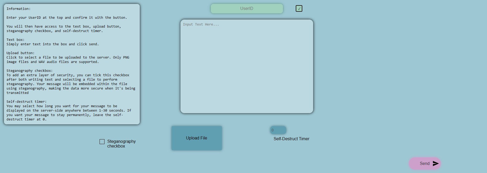
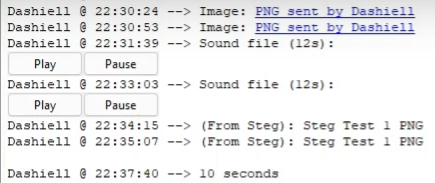
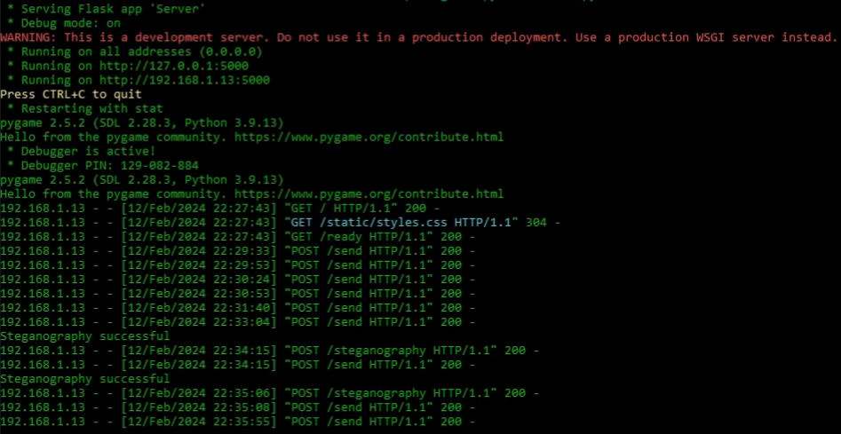

# End-to-End Encrypted Full-Stack Messenger

A secure, real-time messaging application featuring a Python/Flask backend, a vanilla JavaScript/HTML/CSS frontend, and a hybrid end-to-end encryption pipeline. The project also includes a live server monitoring GUI built with Tkinter and a digital forensics module for LSB steganography.

## Screenshots

**Web Application UI**



**Live Server Monitoring GUI**



**Command Prompt Debug Info**



## Key Features

  -  **Hybrid End-to-End Encryption:** The client generates a unique AES-CBC symmetric key, encrypts it with the server's public RSA key (before sending it back), and uses it to encrypt file data.
  -  **Secure File & Message Transfer:** All text messages and files (including thosed used in steganography operations) are symmetrically encrypted.
  -  **Digital Forensics - Steganography Module:** Option for the user to embed a text message in the LSB of a provided PNG or WAV file, hiding the existence of the message. At the other end the text is extracted and displayed.
  -  **Live Server Monitoring GUI:** Tkinter desktop application displays incoming messages in real time, allows for playback and pausing of audio files, and hyperlinks images to be opened in the user's default image app.
  -  **Message Self-Destruct Timer:** The user is able to enter a time-to-live for each message, deleting all information (text, pngs, wavs) relating to that message from the GUI and database after a set period.

## Tech Stack & Architecture

#### Backend
*   **Framework:** `Python (Flask)`
*   **Cryptography:** `cryptography` library for RSA key generation and decryption.
*   **Database:** `SQLite` for message logging.
*   **GUI:** `Tkinter` for the server-side monitoring interface.
*   **Audio Processing:** `Pygame` for playing audio notifications/files.
*   **Image Processing:** `Pillow (PIL)` for steganography operations.

#### Frontend
*   **Language:** `JavaScript (ES6)`
*   **Cryptography:** `node-forge` for client-side RSA/AES encryption.
*   **API Communication:** `Fetch API` for asynchronous requests to the Flask backend.
*   **Styling:** `HTML5` & `CSS3`.

#### Server-Side Helper
*   **Runtime:** `Node.js`
*   **Purpose:** To handle specific AES-CBC dercyption tasks.

## Installation & Setup

1.  **Prerequisites:** Python 3.x, Node.js, npm
2.  **Clone the repository:**
    ```bash
    git clone https://github.com/BossOverlordX/E2E-Encrypted-FullStack-Application.git
    cd E2E-Encrypted-FullStack-Application
    ```
3.  **Install Python dependencies:**
    ```bash
    pip install -r requirements.txt
    ```
4.  **Install Node.js dependencies:**
    ```bash
    npm install
    ```
5.  **Start the server:**
    ```bash
    # This will start both the Flask server & the Tkinter GUI
    python server.py
    ```
6.  **Access the web client:** In the server's output, you will see what IP and port the page is running on.
